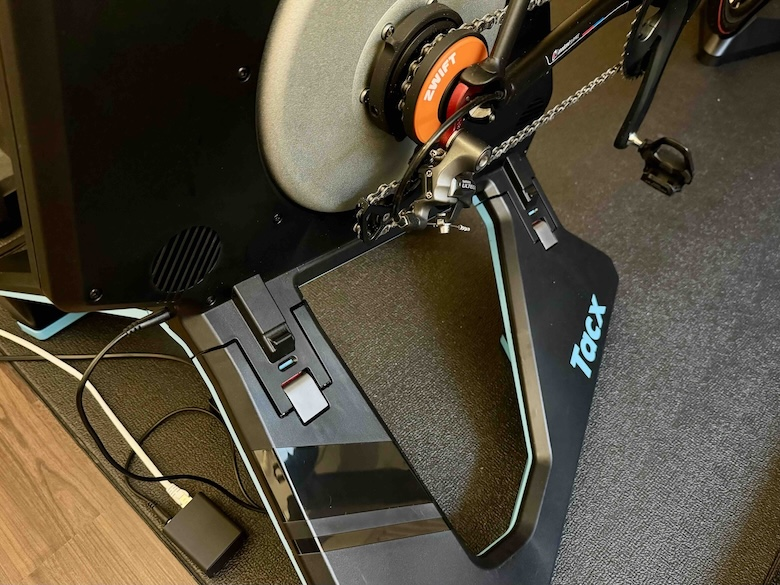
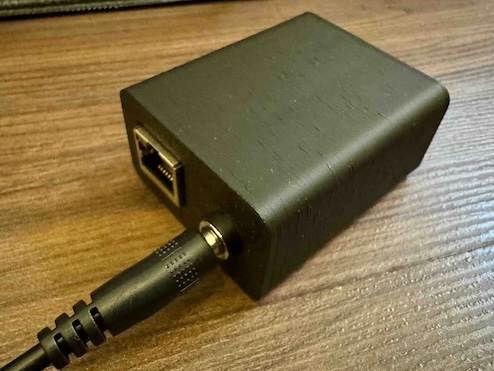
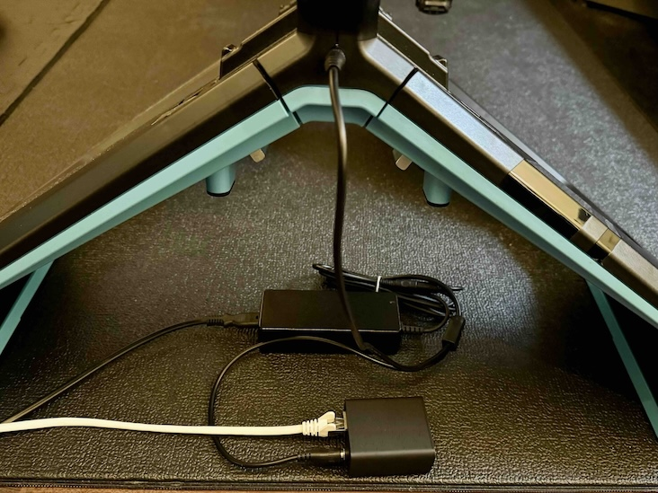

# SHIFTR
A BLE to Direct Connect bridge for bike trainers using a WT32-ETH01 module based on ESP32. Additionally adding Zwift™️ "virtual shifting" functionality to any device supporting FE-C over BLE.

Currently tested with Garmin/Tacx NEO 2T and Vortex but should also work on other trainers supporting FE-C over BLE.

## Overview
Bike trainers heavily evolved over the last years. Tacx (acquired by Garmin some years ago) is one of the market leaders producing bike trainers of a very high quality with special features like e.g. "Road Feeling" to simulate different road surfaces. 
Other vendors like Zwift came up with cool new features like "virtual shifting" using the "Zwift Cog" and a controller device (Zwift Click/Play) to have a non-mechanical shifting solution which is setting the gears via software that adjusts the resistance in the trainer. 
Wahoo came up with a technology called "Direct Connect" that allows the trainer devices to be connected via Ethernet (or even WiFi) instead of bluetooth to have a more stable connection.

While other vendors like e.g. Elite or JetBlack are very fast in implementing things like virtual shifting to their newer models Garmin is very slow and unresponsive when it comes to such feature requests. Probably also because they have their own ecosystem that competes with Zwift. 

Using Zwift since many years and owning a "Tacx Vortex" and a "Tacx Neo 2T" bike trainer I have been jealous to features like virtual shifting and the possibility to connect the trainer device via ethernet. So the idea for this project, SHIFTR, was born by having a device between Zwift and the Tacx supporting all this cool new functionality.

After many days and nights of searching the internet for a specification of the protocols I was only able to find small parts for "Direct Connect" that has already been reverse engineered by Roberto Viola in his [QDomyos-Zwift](https://github.com/cagnulein/qdomyos-zwift) project. The code helped me a lot to understand the protocol.
Unfortunately there was absolutely no information about the "virtual shifting" to be found. So a very long session of decompiling Zwift apps and sniffing BLE traffic between Zwift and capable trainers (which fortunately a friend had one of) started. It took some weeks but I was able to reverse engineer the used protocols.

As I wanted to have a convenient solution that doesn't require a special program or app to be started to have that functionality I decided to implement everything on an ESP32 micro controler that already features WiFi and Bluetooth onboard and also optionally ethernet. The perfect module for that was the [WT32-ETH01](https://en.wireless-tag.com/product-item-2.html) module that comes with everything I needed. The device will be placed very close to the trainer in a 3D printed case that also has place for step down converter to be able to use the existing power supply from the trainer.

Now I have a great setup with a Garmin/Tacx NEO 2T with a Zwift Cog installed and communicating to Zwift via ethernet while still having the "Road Feeling" feature: 

This setup even works great with Zwift running on an Apple TV. Apple TV only support two simultaneous bluetooth connections and those can now be used for the Zwift Play controllers while the trainer itself is being connected through ethernet.

## How it works
The SHIFTR is working in two modes, "Pass-through" and "Pass-through + virtual shifting":
### Pass-through mode
In this mode the SHIFTR just takes all services from the BLE trainer devices and provides them 1:1 via Direct Connect. It supports SIM and ERG mode as if the device would be connected via bluetooth.
### Pass-through + virtual shifting mode
This mode provides the pass through features as mentioned before and additionally offers a special Zwift service via Direct Connect that allows to behave like a Zwift certified device offering virtual shifting, too. All necessary information like incline, bicycle and user weight, etc. are transmitted by Zwift and used for calculations. SIM and ERG mode are supported but of course virtual shifting only works in SIM mode.
### Virtual shifting 
The virtual gears are defined inside Zwift and don't need a special handling in SHIFTR. Zwift just sends the corresponding gear ratio (chainring:sprocket) between 0.75 and 5.49 on every shift. 

Currently these are: 0.75 0.87 0.99 1.11 1.23 1.38 1.53 1.68 1.86 2.04 2.22 2.40 2.61 2.82 3.03 3.24 3.49 3.74 3.99 4.24 4.54 4.84 5.14 5.49

As the Zwift Cog has 14 teeth and a standard chainring 34 teeth the default ratio in SHIFTR is defined at 2.4286 which roughly matches Zwift Gear 12. This ratio is the base for all further gear calculations. Of course the chainring and sprocket teeth can be set in the device configuration and these values will then be used for the default ratio.

Based on this ratio and the selected ratio from Zwift (e.g. 1.23 ~ "Gear 5") the ratio that will later be applied to the trainer's force will be calculated:

$R_{relative} = R_{selected} / R_{standard}$ 

Example: 

$R_{relative} = 1.23 / 2.4286 = 0.51$ (rounded)

To set the correct resistance of the trainer, the gravitational, the rolling and the drag force are calculated using formulas. 

The combined weight of you (the cyclist) and your bike is $W$ ($kg$). The gravitational force constant $g$ is 9.8067 ($m/s^2$). There is a dimensionless parameter, called the "Coefficient of Rolling Resistance", or $C_{rr}$, that captures the bumpiness of the road and the quality of your tires. There are some defaults specified in the FE-C docs:

| Terrain | Coefficient of Rolling Resistance | 
  |-|-:|
  | Wooden Track | 0.001 |
  | Smooth Concrete | 0.002 |
  | Asphalt Road | 0.004 |
  | Rough Road | 0.008 |

This parameter is set by Zwift in normal SIM mode as `0x53`(= 83 dec) and equals (as the unit is $5·10^{-5}$) a value of 0.00415 which is kind of an "Asphalt Road" and also the default mentioned in the FE-C docs. The steepness of a hill will be provided by Zwift in terms of percentage grade $G$.

Regarding the aerodynamic drag the head/tailwind $V_{hw} (m/s)$ isn't been taken into account from Zwift and is assumed 0. But the faster your groundspeed $V_{gs} (m/s)$ is, the more force the air pushes against you. Your airspeed $V_{as} (m/s)$ is the speed that the wind strikes your face, and it is the sum of your groundspeed $V_{gs}$ and the headwind speed $V_{hw}$. As well, you and your bike present a certain frontal area $A (m^2)$ to the air. The larger this frontal area, the more air you have to displace, and the larger the force the air pushes against you. The air density $Rho (kg/m^3)$ is also important. The more dense the air, the more force it exerts on you. Then there is another dimensionless parameter, called the "Drag Coefficient", or $C_{d}$, that captures other effects, like the slipperyness of your clothing and the degree to which air flows laminarly rather than turbulently around you and your bike. 

Having all the values we can calculate as follows:

$F_{gravity} = g · \sin(\arctan(\frac{G}{100})) · W$

$F_{rolling} = g · W · C_{rr}$

As we are calculating with no head/tailwind, our $V_{as}$ equals our $V_{gs}$ as we assume $V_{hw} = 0$ and the calculation would be:

$V_{as} = V_{gs} + V_{hw}$

$F_{drag} = 0.5 · C_d · A · Rho · V_{as}^2$

The FE-C documentation uses a more simple approach by using a bundled coefficient $C_{wr} (kg/m)$ as the "Wind Resistance Coefficient" there:

$C_{wr} = A · C_d · Rho$

| Bicycle and Rider | Frontal Area ($m^2$) | Drag Coefficient |  
  |-|-:|-:|
  | All-terrain (Mountain) Bike | 0.57 | 1.20 |
  | Upright Commuting Bike | 0.55 | 1.15 |
  | Road Bike, Touring Position | 0.40 | 1.0 |
  | Racing Bike, Rider Crouched, Tight Clothing | 0.36 | 0.88 |

As a unit this coefficient uses 0.01 kg/m and the default value of the trainer is `0x33` (=51 dec) which equals 0.51 kg/m while using the standard density of air, 1.275kg/m3 (15°C at sea level) and the "Road Bike" parameters for frontal area and drag coefficient as the default.

$F_{drag} = 0.5 · C_{wr} · V_{as}^2$

The total force is the sum of these three forces:

$F_{total} = F_{gravity} + F_{rolling} + F_{drag}$

In case of $F_{total} >= 0$ the relative gear ratio mentioned above will be applied by multiplication:

$F_{totalGeared} = F_{total} · R_{relative}$

Otherwise in case of $F_{total} < 0$ the relative gear ratio will be subtracted by 1 and then applied by multiplication with the absolute value and added to the original value:

$F_{totalGeared} = F_{total} + (|F_{total}| · (R_{relative} - 1))$

The resulting force will then be used to set the trainer's resistance. Depending on the model there is a maximum force the trainer can apply. For a Tacx Vortex this is 50N and for a Tacx Neo 2T this is 200N. On every connection the maximum force is read out of the trainer. The basic resistance can only be set in 0.5% (0-200) and not in N as expected. So before applying the resistance it will be mapped to the correct 0.5% value. 

In the device settings another method of adjusting the trainer can be selected that currently is kind of experimental but is already working good. It's called "Track Resistance" and will use the trainer's track resistance mode instead of the basic resistance mode to set the calculated force. As this mode doesn't accept neither a force nor percent of the force but instead only the percentage grade/slope. So we have to calculate backwards to get a correct percentage of the desired grade/slope with the gear ratio calculated in. 

This is done by first calculating the force as above but then subtracting the rolling and drag force to only have the gravity force with its gearing factor left. From there we are calculating the grade, that would need to be set to achieve the force we calculated before:

$F_{gravity} = F_{totalGeared} - F_{rolling} - F_{drag}$

$G = \tan(\arcsin(F_{gravity} / W / g)) · 100$

This new grade value is then sent to the trainer in the track resistance mode and so will also support the powered decline feature to provide a better feeling.

***Note***: Virtual shifting will be disabled if neither Zwift Play controllers nor a Zwift Click are connected which results in the standard SIM mode with a track resistance of 0%. Then you'd have to shift with your bike but with a Zwift Cog installed this doesn't make sense of course. If the controllers disconnect during a training then the fallback will be this normal SIM mode but as soon as the controllers a reconnected the virtual shifting will be enabled again.

## Needed hardware
- WT32-ETH01 ESP32 board (e.g. from [Amazon](https://www.amazon.de/WT32-ETH01-Embedded-Schnittstelle-Bluetooth-Entwicklungsplatine/dp/B0CW3DDWZ4))
- Step-Down converter 5-80V (the Tacx Neo supplies 48V) to 5V (e.g. from [Amazon](https://www.amazon.de/dp/B0CMC7Y3DJ))
- Y-Splitter for the Tacx power cable (e.g. from [Amazon](https://www.amazon.de/dp/B09FHHN9T5))
- Power connector for the case (e.g. from [Amazon](https://www.amazon.de/gp/product/B09PD6J4BN))
- 3D printed case that fits the WT32-ETH01. Luckily I was able to find a perfect match that also fits the step-down converter: [WT32-ETH01 Enclosure](https://www.thingiverse.com/thing:5621092)
- Two countersunk screws M2x7 to hold the lid on the case

## Hardware installation
- ***IMPORTANT***: Don't solder the pin headers that came with the WT32-ETH01. With the longer pins on the bottom side the module won't fit the case anymore.
- ***IMPORTANT #2***: Connect the step-down converter first to a power supply (e.g. the original one with 48V) and a multimeter and use a screwdriver to adjust the output voltage to 5V before connecting it to the WT32-ETH01 module!
- Use a standard USB<->TTL converter (e.g. with FTDI232 or similar). Make sure that it can provide **3,3V and not 5V** and connect as follows (see also pinout above):
  | Converter | -> | ETH01-EVO | 
  |-|-|-|
  | RX | -> | TXD |
  | TX | -> | RXD |
  | 3V3 | -> | 3V3 |
  | GND | -> | GND |

  It's best to use some breadboard jumper wires that can just be connected without soldering. Use a rubber band to hold them in contact.

  To start the WT32-ETH01 in boot mode it is necessary to connect "IO0" with GND and then to reset the board shortly connect "EN" to GND for a quarter of a second.

## Software installation
- Make a copy of the provided ``ota.ini.example`` file and name it ``ota.ini`` (you can adjust the values in the file to your needs but also leave it as it is). This is because the credentials shouldn't be committed to GitHub and so they are stored in a separate file that is on the .gitignore list.
- Open the project in [PlatformIO](https://platformio.org) and let it install the dependencies
- Connect the programmer and upload via the task wt32-eth01 -> Upload and Monitor
- Connect an ethernet cable and make sure a DHCP server exists in your network
- After a few seconds you should be able to see the IP address and the hostname (like e.g. "SHIFTR-123456.local") in the monitor log
- If you don't use the Ethernet interface you can also use the WiFi functionality. For that the device opens an AP with the device name (e.g. "SHIFTR 123456") and the password is the same but with "-" instead of space. Please note that WiFi is provided by an external library called [IoTWebConf](https://github.com/prampec/IotWebConf) and more or less untested
- After that you can configure the device and its network settings in the web interface on e.g. http://SHIFTR-123456.local
- Further updates can be made over ethernet or WiFi so you can disconnect the programming adapter now

## Finalization
- Finally you can solder some wires to the power connector to the step down module and from there to the WT32-ETH01. Then mount everything in the 3D printed case:

  

- Use the Y-Power-Splitter to connect the Tacx trainer and the device:
  
  

- Power the Trainer and go to the web interface
- Go to "Settings", select the trainer device and "Save"
- Make sure the "Virtual shifting" option is enabled if you want to use it. Virtual shifting only works in Zwift when a Zwift Click or Zwift Play controllers are connected. Otherwise it will fall back to the normal ERG and SIM modes
- In Zwift you need to connect to the "SHIFTR 123456" device instead of your old device now. Have fun!

## Thank you!
You've made it to the end, hopefully you'll have fun rebuilding the whole thing. Please tell me if you like it and if it works as expected.
In case of any questions feel free to contact me!

## Disclaimer
Please always check the documentation of the hardware you bought as there are sometimes small changes in pin assignments, voltage and so on. I don't take any liability for damages or injuries. Build this project at you own risk. The linked products and pages are for reference only. I don't get any money from the manufacturers or the (re)sellers.

